# Manual de Usuario — Sistema de Facturación

Este documento tiene dos partes:

1. **Información que el cliente debe entregar antes de la puesta en marcha** — un checklist para quien instala/configura el sistema por primera vez en el negocio del cliente.
2. **Manual de uso** — guía paso a paso de cada módulo, para el personal que usará el sistema día a día (cajeros, administración).

---

## Parte 1 — Información requerida del cliente antes de la entrega

Sin estos datos, el sistema **funciona** (se pueden facturar ventas, cobrar, imprimir), pero **la facturación electrónica al SRI no se activa** y los reportes/facturas impresas mostrarán datos de la empresa en blanco o de ejemplo. Reunir esta información *antes* de instalar ahorra una segunda visita.

### 1.1 Datos de la empresa (obligatorio)

| Dato | Ejemplo | Uso |
|---|---|---|
| RUC | `1791234567001` (13 dígitos) | Identifica al emisor ante el SRI; aparece en cada factura. |
| Razón social | `COMERCIAL EL AHORRO S.A.` | Encabezado de facturas y reportes. |
| Dirección matriz | `Av. Principal 123 y Secundaria` | Encabezado de facturas. |
| Teléfono | `042345678` | Encabezado de facturas. |
| ¿Obligado a llevar contabilidad? | Sí / No | Lo determina el régimen tributario del cliente (dato que el propio SRI/su contador les puede confirmar). Se imprime en cada factura. |

### 1.2 Datos para facturación electrónica SRI (obligatorio si van a facturar electrónicamente)

| Dato | Ejemplo | Dónde se obtiene |
|---|---|---|
| Establecimiento | `001` (3 dígitos) | Portal del SRI, ficha del RUC — código del local que emite. |
| Punto de emisión | `001` (3 dígitos) | Portal del SRI — código del punto de venta/caja. |
| Ambiente | Pruebas o Producción | Empezar siempre en **Pruebas**; pasar a Producción solo tras validar. |
| Certificado de firma electrónica (`.p12`/`.pfx`) | archivo entregado por la entidad certificadora | Security Data, ANF, BCE, u otra entidad acreditada en Ecuador. **El cliente debe comprarlo/renovarlo** — el sistema no lo genera. |
| Contraseña del certificado | — | La define la entidad certificadora al emitirlo. |

> ⚠️ El certificado tiene fecha de vencimiento (normalmente 1–2 años). Anotar la fecha de caducidad y avisar al cliente con anticipación — con el certificado vencido, ninguna factura se autoriza.

### 1.3 Infraestructura / base de datos

- ¿Dónde vivirá la base de datos? (¿el mismo equipo del cajero, un servidor local, o un servidor en otra máquina de la red?)
- Si es SQL Server: versión disponible, y si ya existe una instancia o hay que instalarla.
- Nombre/IP del servidor de base de datos si no es la misma máquina (`localhost`).
- ¿Cuántos equipos/cajas van a usar el sistema simultáneamente?

### 1.4 Usuarios del sistema

- Lista de personas que usarán el sistema y su nombre completo (para crear su usuario).
- ¿Todos con el mismo nivel de acceso, o se necesita distinguir cajero vs. administrador? *(Nota: hoy el sistema tiene un solo perfil "Administrador"; si se requieren permisos distintos por rol, es una ampliación a planificar aparte.)*

### 1.5 Catálogo inicial

- Listado de productos con: código, nombre, precio de compra, precio de venta al menor, precio de venta al mayor, stock inicial, y si aplica IVA o no (algunos productos/servicios están exonerados).
- Si el catálogo es grande (cientos de productos), conviene pedirlo en una hoja de cálculo para hacer una carga masiva por base de datos en vez de digitarlo uno por uno desde la pantalla de Productos.

### 1.6 Parámetros del negocio

- Porcentaje de IVA vigente a aplicar (en Ecuador, 15% al momento de escribir esto — puede cambiar por normativa).
- Métodos de pago que aceptan (el sistema ya soporta Efectivo, Tarjeta y Transferencia).

### Checklist rápido para la visita de instalación

- [ ] RUC, razón social, dirección, teléfono, obligado a contabilidad
- [ ] Establecimiento y punto de emisión SRI
- [ ] Certificado `.p12`/`.pfx` + contraseña, y fecha de vencimiento anotada
- [ ] Ambiente de arranque (pruebas primero)
- [ ] Datos del servidor de base de datos
- [ ] Lista de usuarios
- [ ] Catálogo inicial de productos
- [ ] % de IVA vigente confirmado

---

## Parte 2 — Manual de uso

### 2.1 Requisitos del equipo

- Windows 10 u 11 (64 bits).
- Conexión a la base de datos (en la misma red si el servidor es compartido).
- Para facturación electrónica: conexión a internet (el sistema se comunica con los servidores del SRI al emitir cada factura).

### 2.2 Instalación

1. Ejecuta el instalador `Facturacion-<versión>.msi` que te entregaron.

   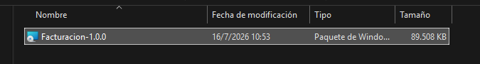

2. Sigue el asistente (Siguiente → Instalar). Al finalizar, el sistema queda disponible desde el menú de inicio y con un acceso directo en el escritorio.

   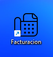

3. La primera vez que se abre, la aplicación crea automáticamente su carpeta de configuración en `%APPDATA%\facturacion\` (no requiere hacerlo manualmente).

### 2.3 Inicio de sesión

1. Abre **Facturacion** desde el acceso directo.
2. Ingresa tu **usuario** y **contraseña** y presiona **Ingresar**.

   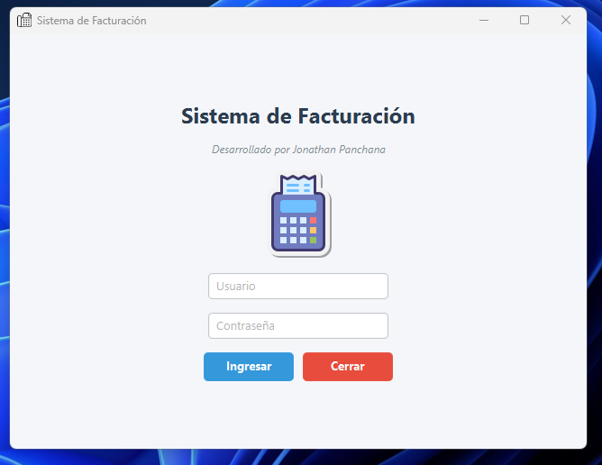

3. Si el usuario o la contraseña son incorrectos, el sistema muestra "Usuario o clave incorrectos" y no entra. Si no logra conectarse a la base de datos, muestra un aviso distinto ("No se pudo validar el acceso a la base de datos") — en ese caso el problema es de conexión, no de credenciales; ver la sección de solución de problemas.

### 2.4 Pantalla principal

Al ingresar, se ve la ventana principal con pestañas: **Inicio**, **Clientes**, **Productos**, **Facturación** y **Reportes**, además de un menú superior con accesos rápidos y el selector de idioma.

  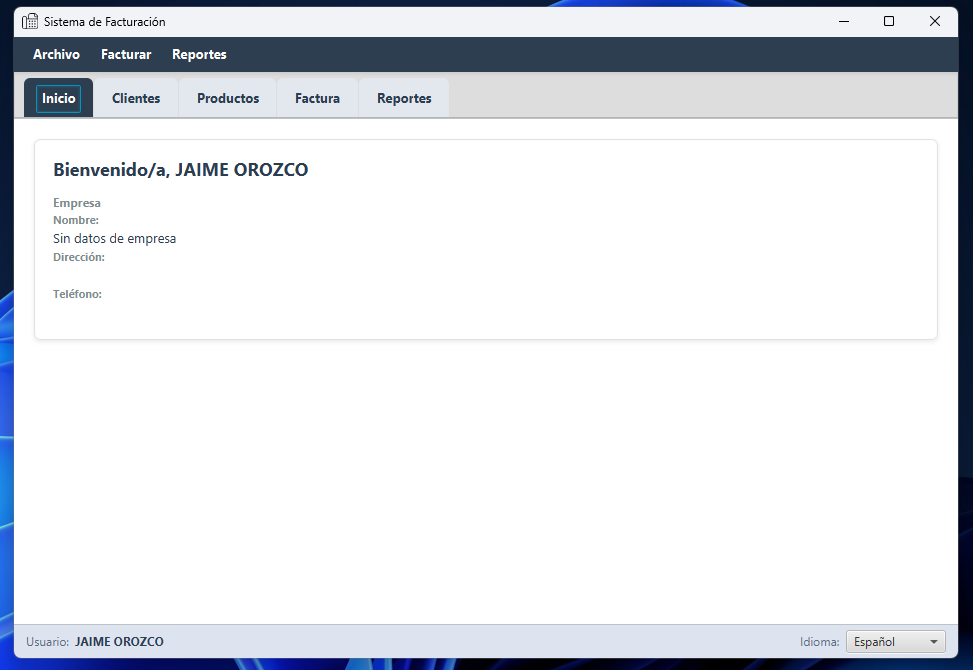

En la pestaña **Inicio** se muestra el nombre, dirección y teléfono de la empresa configurada (si no aparecen, revisa la sección 1.1 — falta configurar `dbo.Empresa`).

### 2.5 Módulo Clientes

1. Ve a la pestaña **Clientes** (o **Archivo → Nuevo Cliente** para el formulario rápido desde cualquier pantalla).

   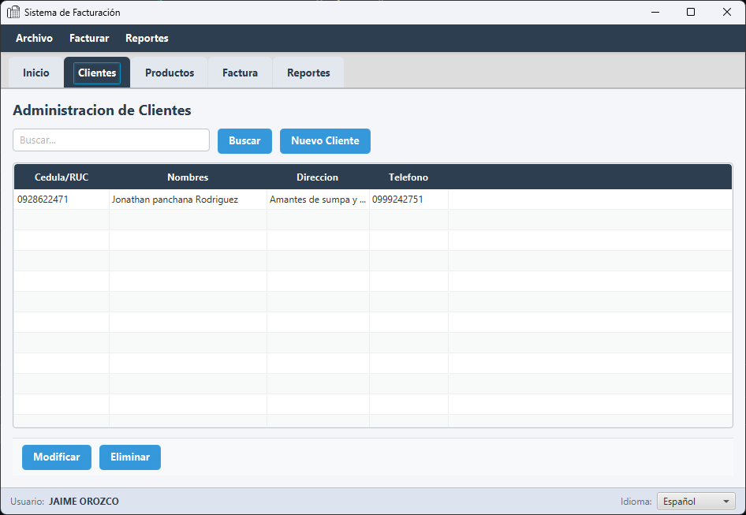

2. Usa el buscador para localizar un cliente existente por cédula/RUC o nombre.
3. **Nuevo Cliente**: completa Cédula/RUC, Nombres, Dirección, Teléfono y Correo, y presiona **Grabar**.

   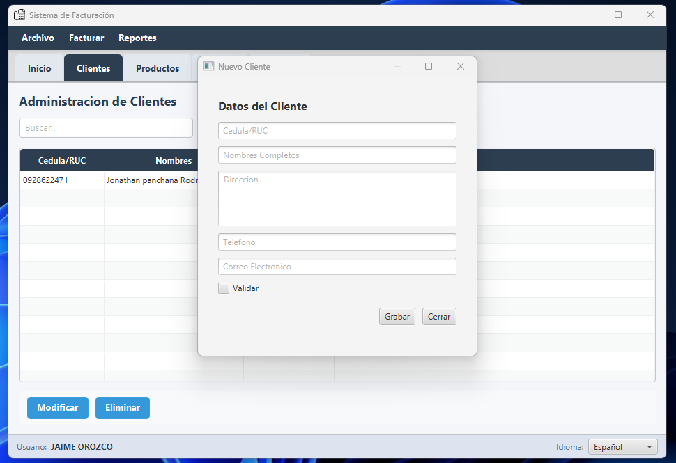

4. **Modificar**: selecciona un cliente de la lista y presiona **Modificar** para editar sus datos.
5. **Eliminar**: da de baja al cliente seleccionado (baja lógica, no borra el historial de facturas asociado).

### 2.6 Módulo Productos

1. Ve a la pestaña **Productos**.

   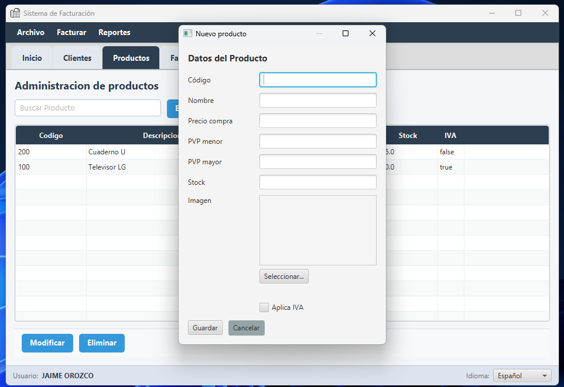

2. **Nuevo Producto**: completa Código, Nombre, Precio de compra, PVP menor, PVP mayor, Stock, si **Aplica IVA**, y opcionalmente una imagen (botón **Seleccionar...**).

   📸 *[Captura: formulario de datos del producto]*

3. **Modificar** / **Eliminar** funcionan igual que en Clientes.

> El campo **Aplica IVA** es importante: los productos sin IVA (marcado en "No") se muestran por separado en la factura como "Subtotal 0%" y no se les suma el impuesto.

### 2.7 Módulo Facturación (emitir una venta)

Este es el flujo principal del día a día.

1. Ve a la pestaña **Facturación** (o **Archivo → Nueva Factura**).

   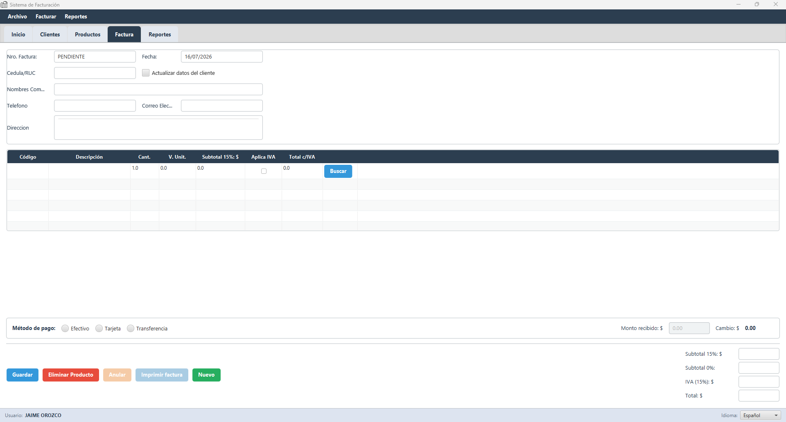

2. **Cliente**: escribe la cédula/RUC en el campo correspondiente. Si el cliente ya existe, sus datos (nombre, teléfono, correo, dirección) se autocompletan al salir del campo. Si no existe, completa al menos el campo **Nombres** — el sistema te preguntará si deseas registrarlo como cliente nuevo al grabar la factura.
   - Si marcas la casilla **Actualizar datos del cliente**, los cambios que hagas en pantalla (teléfono, correo, dirección) se guardan también en la ficha del cliente.
3. **Productos**: en la tabla de detalle, escribe el código del producto y presiona Enter (o usa el botón **Buscar** de cada fila para buscarlo por nombre). Al elegir el producto se completan nombre, precio y si aplica IVA; luego ingresa la **cantidad**.

   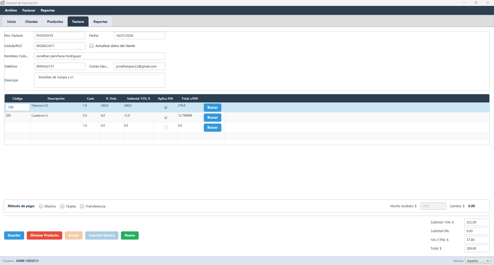

   El sistema agrega automáticamente una fila vacía al final para seguir cargando productos, y calcula en tiempo real **Subtotal 15%**, **Subtotal 0%**, **IVA** y **Total**.
4. **Método de pago**: elige Efectivo, Tarjeta o Transferencia.
   - En **Efectivo**, ingresa el **Monto recibido**; el sistema calcula el **Cambio** automáticamente (en rojo si el monto es insuficiente).

   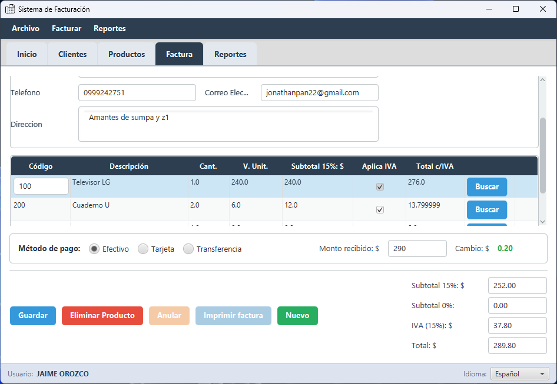

5. Presiona **Guardar**. El sistema:
   - Valida que haya stock suficiente de cada producto (si no, indica cuáles y no emite la factura).
   - Registra la venta y asigna el número de factura.
   - Envía el comprobante al SRI en segundo plano (la ventana no se congela) y muestra el resultado: **AUTORIZADO**, **RECHAZADO** o **PENDIENTE**.

   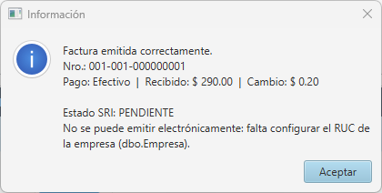

   > Si el estado queda en **PENDIENTE**, la venta ya está registrada y cobrada — no hay que repetirla. El sistema reintenta la autorización automáticamente cada 5 minutos, o se puede reintentar manualmente desde **Reportes** (ver 2.8).

6. **Imprimir factura**: una vez emitida, el botón **Imprimir factura** genera el RIDE en PDF (o lo envía directo a la impresora, según cómo lo uses) con los datos del SRI (clave de acceso, autorización) ya incluidos.
7. **Anular**: anula la factura emitida (repone el stock de los productos). Pide confirmación porque no se puede deshacer.
8. **Nuevo**: limpia el formulario para una nueva venta.

### 2.8 Módulo Reportes

1. Ve a la pestaña **Reportes**.

   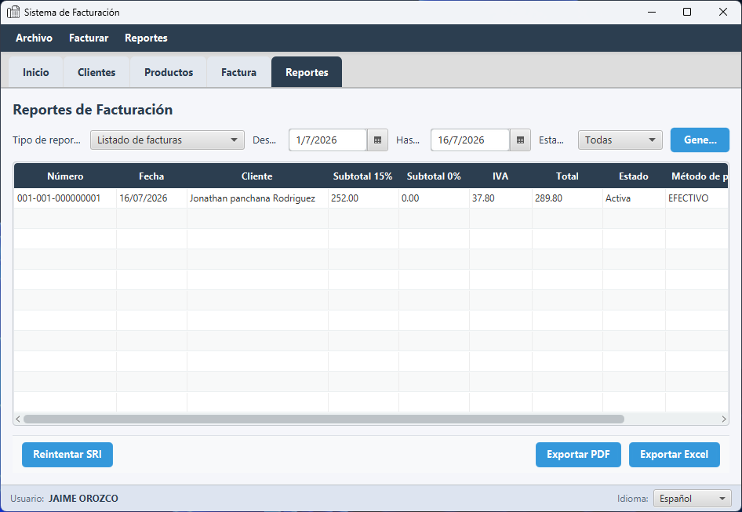

2. Elige el **Tipo de reporte**:
   - **Listado de facturas** — con filtro de estado (Todas/Activas/Anuladas) y columna de estado SRI.
   - **Resumen de ventas** — totales del período: facturas activas/anuladas, subtotales, IVA, total, y desglose por método de pago.
   - **Ranking de productos** — productos más vendidos en el período.
   - **Listado de clientes** y **Listado de productos** — catálogos completos (sin filtro de fecha).
3. Para los reportes con fecha, selecciona el rango **Desde**/**Hasta** y presiona **Generar**.
4. **Exportar PDF** / **Exportar Excel**: guarda el reporte actual en el formato elegido.

   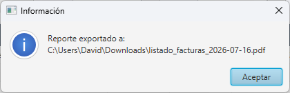

5. **Reintentar SRI**: en el listado de facturas, selecciona una factura en estado `PENDIENTE` (o `RECHAZADO`) y presiona este botón para volver a consultar su autorización ante el SRI sin tener que reemitirla.

### 2.9 Cambiar idioma

En la barra superior de la ventana principal, el selector de idioma permite cambiar entre **Español** y **English** al instante, sin reiniciar la aplicación.

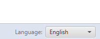

### 2.10 Cerrar sesión / salir

- **Cerrar sesión**: vuelve a la pantalla de login sin cerrar la aplicación (útil al cambiar de cajero).
- **Salir**: cierra la aplicación por completo. Ambas opciones piden confirmación.

---

## Parte 3 — Solución de problemas comunes

| Síntoma | Causa probable | Qué hacer |
|---|---|---|
| "No se pudo validar el acceso a la base de datos" al iniciar sesión | El servidor de base de datos no está encendido/accesible, o las credenciales en `config.properties` están mal. | Confirmar que el servidor de BD esté corriendo y accesible en la red. Revisar `%APPDATA%\facturacion\logs\facturacion.log` para el detalle del error. |
| Mensaje "Invalid column name '...'" en cualquier pantalla | La base de datos no tiene todas las columnas que la versión instalada del sistema espera (típico tras una actualización). | Correr el bloque de migración al final de `databaseScript.sql` contra esa base de datos. |
| Los datos de la empresa aparecen en blanco en la pestaña Inicio o en las facturas | No se ha configurado la fila de `dbo.Empresa` (ver Parte 1, sección 1.1). | Cargar los datos reales de la empresa en esa tabla. |
| Todas las facturas quedan en estado SRI `PENDIENTE` con el mensaje "falta configurar el RUC de la empresa" | Falta la fila de `dbo.Empresa`, o el RUC está vacío. | Igual que el punto anterior. |
| Todas las facturas quedan en `PENDIENTE` con el mensaje "falta configurar la ruta del certificado" | No se cargó el certificado de firma electrónica en `config.properties` (`sri.rutaCertificado`). | Configurar `sri.rutaCertificado` y `sri.claveCertificado` con los datos del certificado del cliente (ver Parte 1, sección 1.2). |
| Una factura queda `RECHAZADO` | El SRI encontró un problema con el comprobante (dato tributario incorrecto, certificado vencido, etc.). | El motivo exacto queda guardado junto a la factura y se puede consultar desde Reportes. Revisar con el contador del cliente si es un problema de datos, o el vencimiento del certificado. |
| "Stock insuficiente" al grabar una factura | El producto no tiene existencias suficientes (puede pasar si otra caja vendió el mismo producto segundos antes). | Verificar el stock real y ajustar la cantidad, o reabastecer el producto. |
| No se puede cambiar la contraseña de un usuario desde la app | Todavía no existe esa pantalla. | Pedir a soporte/TI que actualice la contraseña directamente en la base de datos (`dbo.Usuario`); el sistema la re-protege sola en el siguiente inicio de sesión exitoso del usuario. |

Para cualquier error no listado aquí, el archivo `%APPDATA%\facturacion\logs\facturacion.log` en el equipo donde ocurrió tiene el detalle técnico — es el primer dato a pedir para dar soporte remoto.

